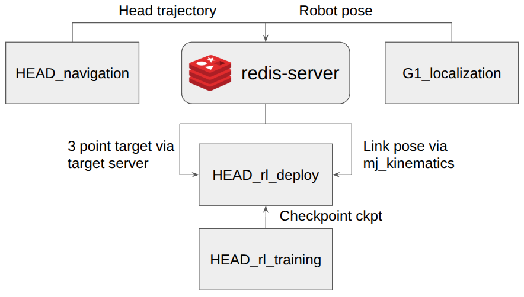

# HEAD Code release
Official Implementation of CoRL 2025 paper: Hand-Eye Autonomous Delivery: Learning Humanoid Navigation, Locomotion and Reaching

## Code organization



## RL Training 
[Code](https://github.com/Stanford-TML/HEAD_rl_training)

## RL Sim2Sim & Sim2Real 
[Code](https://github.com/Stanford-TML/HEAD_rl_deploy)

## Navigation & Reaching 
[Code](https://github.com/JudyYe/head_nav)

## Localization 
[Code](https://github.com/Ericcsr/G1_localization)

## Citation
```
@article{chen2025hand,
  title={Hand-Eye Autonomous Delivery: Learning Humanoid Navigation, Locomotion and Reaching},
  author={Chen, Sirui and Ye, Yufei and Cao, Zi-Ang and Lew, Jennifer and Xu, Pei and Liu, C Karen},
  journal={arXiv preprint arXiv:2508.03068},
  year={2025}
}
```

